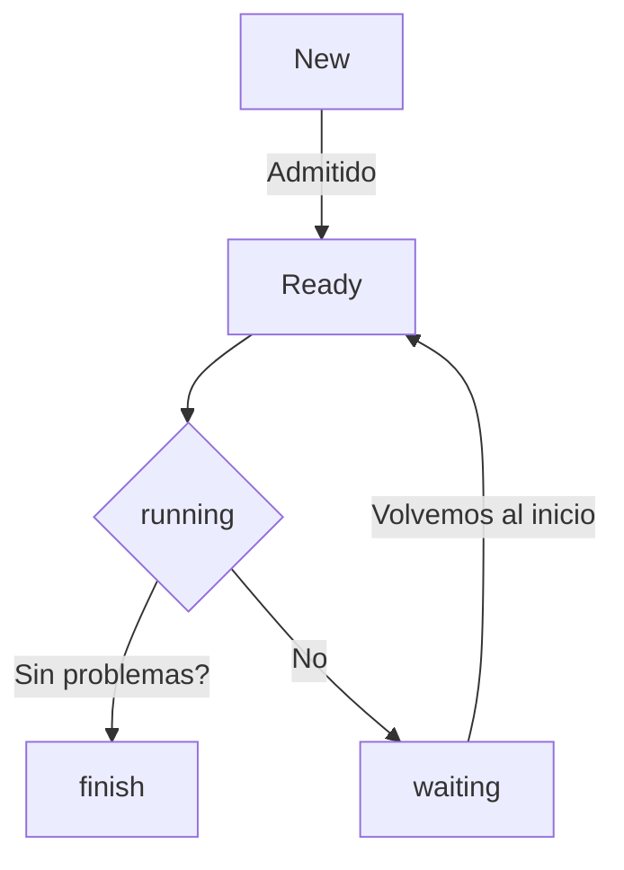

## Procesos
>Existe un aparente paralelismo
	Que se hace real cuando hay un HW dedicado a la operación de multiples procesos secuenciales.
>Destacar que al compilar todo se traduce desde el lenguaje original a ASSemble.

>Hay varias categorias de procesos.
- Procesos asociados a CPU
-  Procesos asociados a I/O
-  Procesos asociados  Independientes
-  Procesos asociados cooperativos
>Asi mismo existen las hebras(threads) que son tipicamente denominados procesos livianos.

==El mejor sistema operativo es aquel que uno no se da cuenta que esta==

